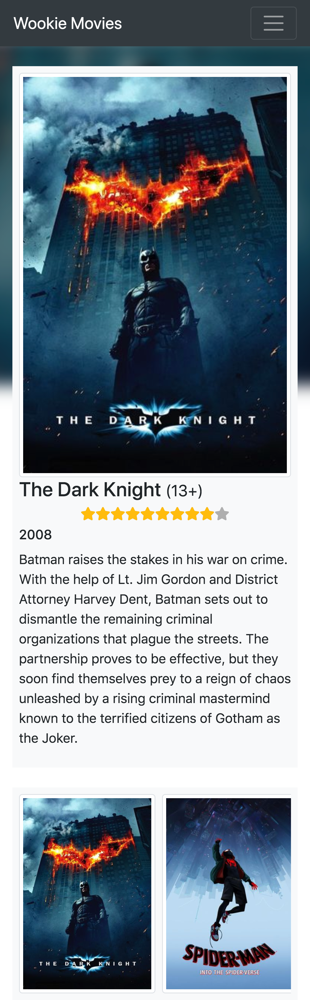

## Vue - Wookie Movies

### Description

You are the owner of a movie theater in **Thikkiiana City,** on the Wookiee homeworld of Kashyyyk. Your customers are bored with the never changing selection and are asking for something completely different - they want to see what's playing on Earth. Wookies are the main exporter of Computer Technology for the New Republic so naturally you roll up your sleeves and get to work. You quickly scribble down some notes and after a few hours of relentless work you have a design in mind.

### Tasks

-   Implement your designs using **Vue Components** and style them using **CSS3**
-   Connect your application to the **CodeSubmit Movie Database** at https://wookie.codesubmit.io/movies
-   For authentication pass the "Authorization: Bearer Wookie2019" header
-   Parse the API response and display the results as outlined in the design. **Group movies by category**.
-   Implement a detail view for the movies in the list
-   Make sure that bookmarking / linking to detail pages works as expected
-   Implement search by connecting to https://wookie.codesubmit.io/movies?q=<search_term>

### Evaluation Criteria

-   Design implemented according to attached files using Vue Components
-   Routing implemented (list, detail)
-   Connect to API - Movies retrieved, JSON parsed, grouped by category
-   Connecting to API Search, search functionality is working
-   Bonus: Use the movies backdrop image creatively
-   Bonus: Use the movies slug for routing

### Demo

#### Detail View

#### Detail Mobile

